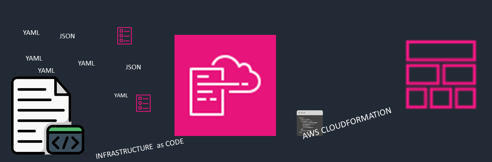
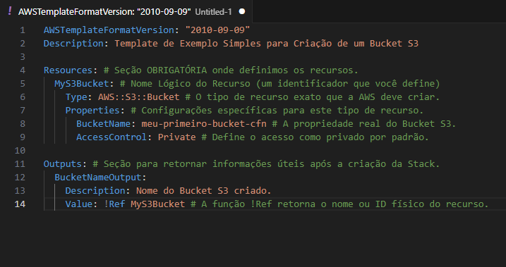

**Implantando Infraestrutura Automatizada com AWS CloudFormation**

Este repositório foi realizado no Bootcamp Code Girls Santander e Dio sobre *AWS CloudFormation*.

Foi cuidadosamente criado para consolidar e aprofundar o conhecimento adquirido através das aulas ministradas na plataforma da Dio. O principal objetivo é fornecer fundamentos teóricos, benefícios relevantes, recursos práticos que envolve o AWS CloudFormation.

**Fundamentos Teóricos**

O que é **AWS CloudFormation**

É um serviço da Amazon Web Service (AWS) que permite modelar e provisionar coleções de recursos da AWS de forma rápida e organizada.

Sua principal função é **permitir** que você trate sua infraestrutura (servidores, banco de dados, redes, permissões, por exemplo) como código, denominado como *Infraestrutura como Código (IaC)*. Isto é, em vez de criar recursos manualmente, você descreve os recursos desejados em um arquivo de texto. 

O CloudFormation não apenas cria a infraestrutura, mas também a gerencia durante todo o seu ciclo de vida, incluindo atualizações e exclusões, e o que conhecemos como Gerenciamento do Ciclo de Vida. Garantindo que os recursos provisionados e mantidos de maneira consistente e em uma ordem correta de dependências.

**Conceitos Chave**

***Templates*** (Modelos) 
São arquivos de textos em formato **JSON** ou **YAML**, que contêm a descrição de todos os recursos da AWS que você deseja implantar. Permitindo a criação, atualização ou até a exclusão, enfim ele realiza o gerenciamento de recursos da AWS de maneira repetível e eficiente. O template especifica a configuração exata de cada recurso, como tipo, propriedades e dependências.

**Componentes Principais**

Incluem seções como Resources (obrigatório), Parameters, Mappings, Outputs.

***Stacks*** (Pilhas)
É a coleção de recursos e aplicações que são gerenciados como uma única unidade. Quando o template cria uma stack, todas as operações (criação, atualização, exclusão) são aplicadas ao nível desta stack, garantindo que os recursos nela contidos permaneçam em um estado consistente. A unidade de provisionamento.

***Resources*** (Recursos)
É qualquer serviço da AWS que pode ser criada, configurada e gerenciada.

**Benefícios Relevantes**

*Automação e Consistência*: garante que os ambientes de infraestrutura sejam idênticos e repetíveis.
*Gerenciamento e Orquestração*: gerencia a ordem correta de criação (orquestração) e as dependências entre eles. 
*Segurança*: em caso de falhas na atualização, realiza um rollback automático para o último estado estável, mantendo a integridade. 
*Reutilização e Padronização*: permite que os templates sejam reutilizados, promovendo a padronização das melhores práticas de infraestrutura em toda a organização.

***Formatos de Templates***: JSON e YAML

O AWS ClouFormation aceita templates em dois formatos de serialização de dados, que possuem diferenças significativas em sintaxe e legibilidade.

**JSON** (JavaScript Object Notation): Formato original, mais universal, e denso. Focado na troca de dados entre sistemas.

**YAML** (YAML Ain’t Markup Language): formato preferido e recomendado para IC. Prioriza a leitura e escrita humana.

**Criação de uma Stack no CloudFormation**

| ETAPA | AÇÃO ESSENCIAL | DETALHES |
|:------ |:-------------- | :------- |
| Preparação | Template Concluído | O código que define sua estrutura |
| Início no console AWS | Acessar CloudFormation e "Criar Stack"| Iniciar o Processo de Provisionamento de uma nova pilha de recursos |
| Fornecer Código | Carregar ou referenciar o Template | Apresentar o projeto de infraestrutura ao CloudFormation |
| Configurações | Definir o Nome e Parâmetros Chave | Personalizar a Stack e injetar parâmetros |
| Execução | Revisar e Confirmar a Criação | Autorizar o CloudFormation a iniciar o provisionamento dos recursos |
| Resultado | Provisionamento Automático | O CloudFormation gerencia a criação e a correta interdependência dos recursos |
| ------- |----------- | --------- |

**Comparativo Essencial** 

Comparar o **CloudFormation** com o **Terraform** é essencial, pois são as duas principais ferramentas de Infraestrutura como Código (IaC) utilizados na AWS.

O AWS ***CloudFormation*** é a solução nativa e gratuita da AWS. Foca em integração profunda e imediata com todos os serviços da nuvem, com estado gerenciado automaticamente pela AWS.

Já a ferramenta HashiCorp **Terraform** se destaca por ser agnóstica (Multi-cloud). Foca em portabilidade e na capacidade de gerenciar infraestrutura em qualquer provedor de nuvem ou serviço. Utiliza a linguagem HCL.

**Exemplo Prático:** 

***Criando um Bucket S3 (Template YAML)***

Este exemplo demonstra como o AWS CloudFormation provisiona um novo Bucket S3 na AWS, usando as configurações básicas.
Template CloudFormation (YAML)
Este template demonstra a estrutura básica (versão, recursos, e outputs) e como o CloudFormation mapeia uma definição em código para um recurso real na nuvem AWS.
O novo Bucket S3  foi denominado: meu-primeiro-bucket-cfn

***Decifrando o Código***

1. *AWSTemplateFormatVersion*: É o cabeçalho padrão, sempre o mesmo. Informa ao CloudFormation qual a versão de sintaxe do template.
2.	*Description*: Uma linha opcional que serve para documentoar o propósito do template.
3. *Resources*: É a seção que o CloudFormation lê para saber o que construir.

 3.1 MyS3Bucket: É um Nome Lógico que damos ao nosso Bucket dentro do template. É como o CloudFormation o identifica.

 3.2 Type: AWS: :S3 : :Bucket : Diz ao CloudFormation que  queremos um recurso do tipo S3 Bucket.

 3.3 Properties: São os parâmetros de configuração desse recurso. Definimos, aqui o nome físico (BucketName) e o controle de acesso (AccessControl).

4.	*Outputs*: Informa ao usuário dados relevantes sobre o recurso após ele ser criado.
O uso de !Ref MyS3Bucket garante que o valor retornado seja o nome físico real criado.

Vimos que, ao usar templates YAML ou JSON para definir recursos em Stacks, eliminamos a complexidade de gerenciar serviços individualmente. 
Assim, dominar o CloudFormation significa adotar a mentalidade de Infraestrutura como Código (IaC). Isso nos garante repetibilidade, automação e consistência em qualquer ambiente. 

